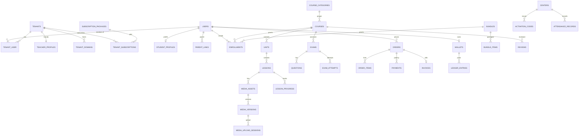

# Database Seeder & Schema Reference (Frontend Guide)

A code-accurate map of the data produced by
[`database/seeders/DatabaseSeeder.php`](../database/seeders/DatabaseSeeder.php) —
written for **frontend developers** who need to know *what data exists*, *how to
log in*, and *the exact shape of every field* (types, enums, JSON blobs,
relationships) they will render.

> This reflects the seeder as it currently stands: **2 active academies** +
> **1 archived (soft-deleted) academy**. Every application table is populated and
> **no column is left empty** — nullable "state" columns (`read_at`,
> `deleted_at`, `canceled_at`, `revoked_at`, …) are filled in *some* rows and
> left null in others so you can build/test every UI state.

| | |
|---|---|
| **Stack** | Laravel 13 · PHP 8.3 · MySQL · Sanctum tokens · multi-tenant |
| **Seed command** | `php artisan db:seed` (or `php artisan migrate:fresh --seed`) |
| **Password (every account)** | `password` |
| **Money** | integer **minor units** + `currency` (e.g. `price_minor: 45000` = 450.00 EGP) |
| **Dates** | ISO-8601 UTC |
| **Default locale** | `ar` (Arabic, UTF-8); teachers also enable `en` |
| **Rows seeded** | ~525 across 47 tables |

---

## Table of contents

1. [Running the seeder](#1-running-the-seeder)
2. [Login accounts & tenant selection](#2-login-accounts--tenant-selection)
3. [Conventions every frontend dev needs](#3-conventions-every-frontend-dev-needs)
4. [Multi-tenancy: what's visible to whom](#4-multi-tenancy-whats-visible-to-whom)
5. [Schema reference by module](#5-schema-reference-by-module)
6. [Enum catalog](#6-enum-catalog)
7. [JSON field shapes (authentic examples)](#7-json-field-shapes-authentic-examples)
8. [Seeded catalog & state-coverage matrix](#8-seeded-catalog--state-coverage-matrix)
9. [Entity-relationship overview](#9-entity-relationship-overview)

---

## 1. Running the seeder

```bash
php artisan db:seed            # seed on top of migrated schema
php artisan migrate:fresh --seed   # drop, re-migrate, then seed
```

⚠️ **The seeder truncates all application tables first** (with FK checks off) and
re-inserts, so it is safely **re-runnable** and always yields the same dataset.
It does **not** touch framework tables (`migrations`, `cache*`, `jobs`,
`job_batches`, `failed_jobs`). Run it only against a database you're happy to
reset (local/dev).

---

## 2. Login accounts & tenant selection

Every account's password is **`password`**. Users log in with their **phone**
(email is also present and unique). A user is **global**; their **role is
per-tenant** (`tenant_user` table).

### Platform admin (no tenant)
| Phone | Name | Notes |
|---|---|---|
| `01000000000` | إدارة منصة العميد | `is_platform_admin = true`; operates `/admin/*` on the central host only |

### Academy A — `farag-physics` (الفيزياء)
Send header **`X-Tenant: farag-physics`** (dev) or use host `farag-physics.elameed.app`.

| Role | Phone | Name | Membership status |
|---|---|---|---|
| Teacher (owner) | `0101000001` | الأستاذ محمود فرّاج | active |
| Assistant | `0101000011` / `0101000012` | أ. كريم عادل / أ. دعاء منصور | active |
| Student | `0101000101` | أحمد سمير | active |
| Student | `0101000102` | منة الله حسن | active |
| Student | `0101000103` | يوسف خالد | active |
| Student | `0101000104` | سارة إبراهيم | active |
| Student | `0101000105` | عمر طارق | **suspended** (test `403` inactive) |
| Student | `0101000106` | ندى محمود | **pending** (test `403` inactive) |
| Parent | `010100021` / `010100022` | سمير عبد الله / هدى فؤاد | active (linked to students 1 & 2) |

### Academy B — `sara-chemistry` (الكيمياء)
Send header **`X-Tenant: sara-chemistry`**.

| Role | Phone | Name | Membership status |
|---|---|---|---|
| Teacher (owner) | `0102000001` | د. سارة عبد الرحمن | active |
| Assistant | `0102000011` / `0102000012` | أ. منة الله رضا / أ. عبد الله شاكر | active |
| Student | `0102000101`–`0102000103`, `0102000105` | مريم علاء … جنى أشرف | active |
| Student | `0102000104` | مازن وليد | **suspended** |
| Parent | `010200021` / `010200022` | علاء الدين محمد / فاطمة صبري | active |

### Academy C — `closed-academy` (archived)
A **soft-deleted** tenant (`status = expired`, `deleted_at` set) with a
**canceled** subscription and **no active teacher account**. It exists only so
the lifecycle columns `tenants.deleted_at` and `tenant_subscriptions.canceled_at`
are populated — you normally won't render it.

> These are demo phone numbers (not all are 11-digit Egyptian format). Treat them
> as opaque login identifiers.

---

## 3. Conventions every frontend dev needs

### Money
Always an integer **minor unit** field (suffix `_minor`, e.g. `price_minor`,
`total_minor`, `amount_minor`) paired with a 3-letter `currency` (always `"EGP"`
in seed data). Divide by 100 for display: `45000 → 450.00 EGP`. **Wallet balances
are derived** from `ledger_entries` (credits − debits), never stored.

### Booleans
Stored as `tinyint(0|1)` in MySQL but returned as real JSON booleans through
model casts (`is_free`, `is_center`, `is_published`, `downloadable`, `success`,
`is_visible`, `hide_ranking`, `login_enabled`, `registration_enabled`, …).

### Enums
Stored/returned as **strings** (e.g. `visibility: "visible"`, `status: "paid"`).
Full list in [§6](#6-enum-catalog).

### IDs, UUIDs & slugs — what goes in a URL
Many models expose a `uuid` and/or `slug` used for public/route binding instead
of the numeric `id` (to avoid enumeration). Bind keys per resource:

| Resource | Public URL key | Teacher/authoring URL key |
|---|---|---|
| Course | `slug` | `uuid` |
| Bundle | `slug` | `uuid` |
| Exam | — | `uuid` |
| Order | — | `uuid` |
| Media asset | — | `uuid` |
| Unit / Lesson | `id` (own tenant) | `id` |
| Everything else | `id` | `id` |

Models carrying a `uuid`: `users`, `tenants`, `courses`, `bundles`,
`media_assets`, `orders`, `exams`, `centers`, `activation_codes`,
`subscription_packages`, `tenant_subscriptions`. `invoices.eta_receipt_uuid` is a
tax-authority receipt id, not a route key.

### Timestamps
`created_at` / `updated_at` on most tables (ISO-8601 UTC). Append-only tables
have **no `updated_at`** (`ledger_entries`, `points_entries`, `login_attempts`,
`audit_logs`); `student_badges` has neither (uses `awarded_at`);
`playback_sessions` uses `issued_at` / `expires_at` / `revoked_at`.

---

## 4. Multi-tenancy: what's visible to whom

- Every **tenant-scoped** table has a `tenant_id`. A global query scope
  (`BelongsToTenant`) automatically filters reads to the resolved tenant, so the
  API only ever returns the current academy's rows — you never send `tenant_id`
  yourself.
- **Public** browse endpoints return only **published** content: `visibility =
  visible` **and** `publish_at` in the past. Teachers see all their own content
  regardless.
- **Not** tenant-scoped (shared/global) tables: `users`, `tenants`,
  `tenant_domains`, `tenant_user`, `subscription_packages`,
  `tenant_subscriptions`, `otp_codes`, `login_attempts`, `audit_logs`,
  `media_callback_events`, `sessions`, `password_reset_tokens`,
  `personal_access_tokens`.

---

## 5. Schema reference by module

Legend: **Null?** ✓ = nullable · **FK** → referenced table · *(enum)* values in [§6](#6-enum-catalog).

### 5.1 Tenancy

**`tenants`** — one row per academy. *Not* tenant-scoped. Soft-deletes.
| Field | Type | Null? | Notes |
|---|---|:--:|---|
| `id` | bigint | | PK |
| `uuid` | uuid | | unique |
| `slug` | string | | unique; used as `X-Tenant` + subdomain label |
| `name` | string | | academy display name (Arabic) |
| `status` | string | | *(TenantStatus)* `active` in seed (C = `expired`) |
| `owner_user_id` | bigint | ✓ | FK → users (the teacher) |
| `dedicated_db_connection` | string | ✓ | `"shared"` in seed (VIP escape hatch) |
| `package_id` | bigint | ✓ | FK → subscription_packages |
| `trial_ends_at` | datetime | ✓ | |
| `deleted_at` | datetime | ✓ | set only on the archived academy |

**`tenant_domains`** — host → tenant map. One primary subdomain + one custom host per academy.
| Field | Type | Null? | Notes |
|---|---|:--:|---|
| `tenant_id` | bigint | | FK → tenants |
| `host` | string | | unique, e.g. `farag-physics.elameed.app` |
| `type` | string | | *(TenantDomainType)* `subdomain` \| `custom` |
| `is_primary` | bool | | |
| `cf_custom_hostname_id` | string | ✓ | Cloudflare hostname id |
| `ssl_status` | string | ✓ | `active` \| `pending_validation` \| `revoked` |
| `verified_at` | datetime | ✓ | null while pending |

**`teacher_profiles`** — branding + landing page (one per tenant). See [§7](#teacher_profiles).
| Field | Type | Null? | Notes |
|---|---|:--:|---|
| `tenant_id` | bigint | | unique, FK → tenants |
| `logo_url`, `cover_url` | string | ✓ | image URLs |
| `primary_color`, `secondary_color` | string(9) | ✓ | hex `#RRGGBB` |
| `bio` | text | ✓ | |
| `contact` | json | ✓ | `{phone,email,whatsapp,address}` |
| `socials` | json | ✓ | `{facebook,youtube,instagram,tiktok,telegram}` |
| `landing_sections` | json | ✓ | **the whole landing page** — see [§7](#teacher_profiles) |
| `locales` | json | ✓ | e.g. `["ar","en"]` |
| `primary_locale` | string(8) | | `ar` |
| `layout` | string(32) | | `classic` \| `grid` \| `spotlight` |
| `hide_ranking` | bool | | hide the student leaderboard |
| `login_enabled`, `registration_enabled` | bool | | auth toggles for the academy |

### 5.2 Identity

**`users`** — global identity. Soft-deletes: no.
| Field | Type | Null? | Notes |
|---|---|:--:|---|
| `id`, `uuid` | bigint / uuid | | |
| `name` | string | | |
| `email` | string | ✓ | unique-where-present |
| `phone` | string | ✓ | unique-where-present; primary login id |
| `email_verified_at`, `phone_verified_at` | datetime | ✓ | set in seed |
| `password` | string | | bcrypt hash (`password`) |
| `locale` | string(8) | | `ar` |
| `is_platform_admin` | bool | | true only for the admin |
| `remember_token` | string | ✓ | |

**`tenant_user`** — membership pivot (a user's role in a tenant).
| Field | Type | Null? | Notes |
|---|---|:--:|---|
| `tenant_id`, `user_id` | bigint | | FKs; unique with `role` |
| `role` | string | | *(TenantUserRole)* `teacher`\|`assistant`\|`student`\|`parent` |
| `status` | string | | *(MembershipStatus)* `active`\|`pending`\|`suspended` |
| `joined_at` | datetime | ✓ | |

**`student_profiles`** — extra student fields (one per student).
| Field | Type | Null? | Notes |
|---|---|:--:|---|
| `tenant_id`, `user_id` | bigint | | unique together |
| `gender` | string | ✓ | `ذكر` \| `أنثى` (free text) |
| `governorate`, `region` | string | ✓ | المحافظة / المنطقة |
| `academic_year` | string | ✓ | e.g. `الصف الثالث الثانوي` |
| `education_type` | string | ✓ | `عام` \| `أزهري` |
| `guardian_phone` | string(30) | ✓ | |

**`parent_links`** — parent ↔ student.
| Field | Type | Null? | Notes |
|---|---|:--:|---|
| `tenant_id` | bigint | | |
| `parent_user_id`, `student_user_id` | bigint | | FKs → users |
| `relation` | string | ✓ | `father` \| `mother` \| `guardian` |

**`otp_codes`** (global) — `identifier`, `channel` (`sms`\|`email`), `purpose`
*(OtpPurpose `register`\|`login`\|`reset`)*, `code_hash`, `attempts`,
`expires_at`, `consumed_at` (✓ null = unused).

**`login_attempts`** (global) — `user_id`✓, `tenant_id`✓, `identifier`, `ip`,
`user_agent`, `success` (bool), `created_at`. Append-only.

### 5.3 Catalog

**`course_categories`** — `name`, `grade`, `subject`, `level`, `section`, `sort_order`. All tenant-scoped.

**`courses`** — the sellable course. Binds by `slug` (public) / `uuid` (teacher). Soft-deletes.
| Field | Type | Null? | Notes |
|---|---|:--:|---|
| `uuid`, `tenant_id` | | | |
| `title`, `subtitle` | string | subtitle ✓ | |
| `slug` | string | | unique per tenant |
| `description` | text | ✓ | |
| `learning_outcomes`, `requirements`, `audience` | json | ✓ | `string[]` |
| `parts` | json | ✓ | `[{title, lessons_count, duration_min}]` (marketing outline) |
| `category_id` | bigint | ✓ | FK → course_categories |
| `price_minor` | bigint | | 0 when free |
| `currency` | string(3) | | `EGP` |
| `access_days` | int | ✓ | validity window after purchase; null = lifetime |
| `visibility` | string | | *(ContentVisibility)* `visible`\|`hidden`\|`scheduled` |
| `publish_at` | datetime | ✓ | |
| `is_free`, `purchase_enabled`, `is_center` | bool | | |
| `cover_url`, `thumbnail_url`, `promo_video_url` | string | ✓ | |
| `points` | int | | gamification points on completion |

**`units`** — chapters. `course_id`, `title`, `sort_order`, `visibility`, `publish_at`✓.

**`lessons`** — `unit_id`, `course_id`, `title`, `description`✓, `sort_order`, `video_asset_id`✓ (FK → media_assets), `youtube_url`✓, `active_video_source` *(VideoSource `upload`\|`youtube`)*, `duration_sec`✓, `max_views`✓, `is_free_preview` (bool), `gating_rule`✓ (json `{requires_exam_id, min_progress_percent}`), `visibility`, `publish_at`✓.

> **Dual video source:** a lesson may carry a protected uploaded video
> (`video_asset_id`) **and/or** a `youtube_url`; `active_video_source` says which
> one students get. Uploaded lessons in seed have an HLS `media_assets` row;
> YouTube lessons have `youtube_url` and `video_asset_id = null`.

**`bundles`** — packages of courses/units/lessons. Binds by `slug`/`uuid`. Soft-deletes. Same shape as courses (`title`, `subtitle`✓, `slug`, `description`✓, `price_minor`, `currency`, `access_days`✓, `visibility`, `publish_at`✓, `is_free`, `purchase_enabled`, `cover_url`✓, `thumbnail_url`✓).

**`bundle_items`** — `bundle_id`, `item_type` (`course`\|`unit`\|`lesson`), `course_id`✓, `unit_id`✓, `lesson_id`✓ (exactly one set), `sort_order`.

### 5.4 Media

**`media_assets`** — a video / pdf / file / link attached to a lesson. Binds by `uuid`.
| Field | Type | Null? | Notes |
|---|---|:--:|---|
| `uuid`, `tenant_id` | | | |
| `lesson_id` | bigint | ✓ | FK → lessons |
| `type` | string | | *(MediaType)* `hls_video`\|`pdf`\|`file`\|`link` |
| `status` | string | | *(MediaStatus)* `uploading`\|`transcoding`\|`ready`\|`failed` |
| `provider` | string | | `local` \| `remote` |
| `current_version_id` | bigint | ✓ | FK → media_versions (the servable one) |
| `thumbnail_url` | string | ✓ | |
| `title` | string | ✓ | |
| `source_key`, `hls_path`, `encryption_key_ref` | string | ✓ | video-only |
| `renditions` | json | ✓ | `[{height,bandwidth,codecs}]` (video) |
| `duration_sec` | int | ✓ | |
| `url` | string(2048) | ✓ | for `file`/`link`/`pdf` (video uses `hls_path`) |
| `watermark_policy` | string | ✓ | `dynamic_overlay`\|`footer_stamp`\|`none` |
| `downloadable` | bool | | |
| `access_scope` | string | ✓ | `enrolled`\|`public`… |
| `sort_order` | int | | |

**`media_versions`** — versioned encodings per asset. `version`, `provider`, `state` *(MediaVersionState: `pending`\|`uploading`\|`uploaded`\|`processing`\|`ready`\|`failed`\|`replacing`\|`quarantined`\|`purged`)*, `host_video_id`✓, `playback_id`✓, `thumbnail_url`✓, `duration_sec`✓, `meta`✓ (json), `error`✓, `ready_at`✓.

**`media_upload_sessions`** — resumable-upload handshakes. `media_version_id`, `created_by`✓, `idempotency_key`, `host_upload_id`✓, `upload_url`✓, `protocol` (`tus`\|`multipart`), `size_bytes`✓, `max_bytes`✓, `content_type`✓, `checksum_sha256`✓, `state` (`created`\|`uploading`\|`uploaded`\|`verified`\|`expired`\|`failed`), `expires_at`✓.

**`media_renditions`** — per-student encrypted HLS copy. `media_asset_id`, `user_id`, `status` (`transcoding`\|`ready`\|`failed`), `hls_dir`, `enc_key` (encrypted at rest), `iv`, `segment_count`, `error`✓.

**`playback_sessions`** — signed playback grants. `user_id`, `lesson_id`✓, `media_asset_id`✓, `media_version_id`✓, `scope` (`student`\|`preview`), `token_hash`, `device_fingerprint`✓, `ip`✓, `issued_at`✓, `expires_at`, `revoked_at`✓.

**`media_callback_events`** (global) — media-host webhook log. `event_id` (unique), `tenant_id`✓, `media_version_id`✓, `type`, `payload_hash`, `processed_at`✓.

### 5.5 Commerce

**`orders`** — binds by `uuid`. `user_id`, `total_minor`, `currency`, `coupon_id`✓ (P1.5), `status` *(OrderStatus `pending`\|`paid`\|`failed`\|`refunded`)*.

**`order_items`** — `order_id`, `item_type` (`course`\|`bundle`\|`wallet_topup`\|`book`), `item_id`✓, `price_minor`, `title`✓.

**`payments`** — `order_id`, `gateway` (`paymob`\|`fawry`\|`wallet`), `gateway_txn_id`✓ (unique), `amount_minor`, `status` (`pending`\|`paid`\|`failed`), `reference_number`✓ (Fawry), `raw_payload`✓ (json), `processed_at`✓.

**`invoices`** — `order_id`, `number` (int, unique per tenant), `pdf_url`✓, `eta_receipt_uuid`✓, `issued_at`✓.

**`enrollments`** — the single source of truth for content access.
| Field | Type | Null? | Notes |
|---|---|:--:|---|
| `user_id` | bigint | | |
| `course_id` | bigint | ✓ | whole-course grant |
| `unit_id` | bigint | ✓ | chapter grant (from a bundle) |
| `lesson_id` | bigint | ✓ | single-lesson grant (from a bundle) |
| `bundle_id` | bigint | ✓ | which package it came from |
| `source` | string | | *(EnrollmentSource)* `purchase`\|`wallet`\|`code`\|`manual`\|`center` |
| `starts_at`, `expires_at` | datetime | ✓ | null expiry = lifetime |
| `status` | string | | *(EnrollmentStatus)* `active`\|`expired`\|`cancelled` |

> **Access rule:** an enrollment grants access when `status = active` **and** now
> is within `[starts_at, expires_at]` (null bounds = open). A course grant opens
> all its lessons + exams; a unit grant opens that chapter's lessons; a lesson
> grant opens just that lesson. Free courses / free-preview lessons are always open.

### 5.6 Wallet

**`wallets`** — one per student. `user_id`, `currency`. Unique `(tenant_id,user_id)`.

**`ledger_entries`** — append-only double-entry (Σdebits == Σcredits per operation).
| Field | Type | Null? | Notes |
|---|---|:--:|---|
| `wallet_id` | bigint | ✓ | set only on `student_wallet` legs |
| `account` | string | | `student_wallet`\|`teacher_earnings`\|`platform_commission`\|`gateway_clearing` |
| `direction` | string | | `debit` \| `credit` |
| `amount_minor` | bigint | | |
| `ref_type`, `ref_id` | string / bigint | ✓ | e.g. `order` + order id |
| `idempotency_key` | string | | unique per leg |
| `created_at` | datetime | ✓ | no `updated_at` |

### 5.7 Assessment

**`exams`** — binds by `uuid`. Soft-deletes.
| Field | Type | Null? | Notes |
|---|---|:--:|---|
| `uuid`, `tenant_id` | | | |
| `course_id` | bigint | | FK → courses |
| `lesson_id` | bigint | ✓ | per-lesson exam (else course-level) |
| `title` | string | | |
| `type` | string | | *(ExamType)* `exam` \| `assignment` |
| `pass_percent` | tinyint | | |
| `duration_min` | int | ✓ | null = untimed |
| `attempts_allowed` | int | | 0 = unlimited |
| `question_order` | string | | `fixed` \| `random` |
| `scoring` | string | | `best` \| `last` \| `first` |
| `starts_at`, `ends_at` | datetime | ✓ | |
| `result_visibility` | string | | `immediate`\|`after_close`\|`manual` |
| `show_answers` | bool | | |
| `depends_on_exam_id` | bigint | ✓ | FK → exams (prerequisite chain) |
| `mode` | string | | *(ExamMode)* `standard` \| `bubble_sheet` |
| `is_published` | bool | | |

**`questions`** — `exam_id`✓, `category_id`✓, `type` *(QuestionType `mcq`\|`true_false`\|`short`\|`essay`\|`file`)*, `body`✓, `options`✓ (json array), `correct`✓ (json array of indices — **hidden from students**), `points`, `book_ref`✓ (json `{book,page,qno}`), `sort_order`.

**`exam_attempts`** — `exam_id`, `user_id`, `attempt_number`, `started_at`✓, `submitted_at`✓, `score`✓, `max_score`✓, `status` *(AttemptStatus `in_progress`\|`submitted`\|`graded`)*, `answers`✓ (json — see [§7](#exam_attempts)), `needs_manual_grade` (bool).

### 5.8 Engagement

**`reviews`** — `course_id`, `user_id`✓ (null for imported/guest testimonials), `author_name`✓ (set when `user_id` is null), `rating` (1–5), `comment`✓, `is_visible` (bool). One review per `(course_id,user_id)`.

**`lesson_progress`** — `enrollment_id`✓, `lesson_id`, `user_id`, `watch_percent` (0–100), `watch_seconds`, `sessions_count`, `last_position_sec`, `completed_at`✓ (null = in progress). Unique `(tenant,user,lesson)`.

**`favorites`** — `user_id`, `course_id`. Unique `(tenant,user,course)`.

**`points_entries`** — append-only. `user_id`, `points` (signed int), `reason` (`lesson.completed`\|`exam.passed`\|`manual`), `ref_type`✓, `ref_id`✓, `idempotency_key`✓ (unique), `created_at`.

**`badges`** — `name`, `description`✓, `icon`✓ (emoji in seed), `points_threshold`✓.
**`student_badges`** — `user_id`, `badge_id`, `awarded_at`✓ (no created/updated timestamps).

### 5.9 Billing

**`subscription_packages`** (global) — teacher plans. Binds by `uuid`. Soft-deletes.
`slug` (unique), `name`, `description`✓, `price_minor`, `currency`, `interval` *(BillingInterval `monthly`\|`yearly`)*, `trial_days`, `limits`✓ (json — see [§7](#subscription_packages)), `is_active` (bool), `sort_order`.

**`tenant_subscriptions`** (global) — a tenant's plan. Binds by `uuid`. `tenant_id`, `package_id`, `status` *(SubscriptionStatus `trialing`\|`active`\|`past_due`\|`canceled`\|`expired`)*, `price_minor` (locked at assignment), `currency`, `started_at`✓, `trial_ends_at`✓, `renews_at`✓, `ends_at`✓, `canceled_at`✓, `meta`✓ (json).

### 5.10 Centers

**`centers`** — binds by `uuid`. `name`, `address`✓, `phone`✓, `is_active` (bool).

**`activation_codes`** — binds by `uuid`. `code`, `type` *(CodeType `wallet`\|`course`)*, `amount_minor`✓ (wallet codes), `course_id`✓ (course codes), `center_id`✓, `batch`✓, `status` *(CodeStatus `active`\|`redeemed`\|`disabled`)*, `redeemed_by`✓, `redeemed_at`✓, `expires_at`✓.

**`attendance_records`** — `center_id`, `user_id`, `course_id`✓, `attended_on` (date), `status` (`present`\|`absent`), `marked_by`✓, `source` (`online`\|`offline`), `external_ref`✓, `note`✓. Unique `(center,user,attended_on)`.

### 5.11 Notifications & Reporting

**`notifications`** — `user_id`, `channel` (`in_app`\|`sms`\|`whatsapp`\|`email`), `type` (event key, e.g. `purchase.completed`), `template_id`✓, `payload`✓ (json), `status` (`pending`\|`sent`\|`failed`), `sent_at`✓, `read_at`✓ (null = unread).

**`audit_logs`** (global, append-only) — `tenant_id`✓ (null = platform-level), `actor_user_id`✓, `action`, `subject_type`✓, `subject_id`✓, `meta`✓ (json), `ip`✓, `created_at`.

**Auth-support (global):** `sessions` (`id`, `user_id`✓, `ip_address`✓, `user_agent`✓, `payload`, `last_activity`), `password_reset_tokens` (`email`, `token`, `created_at`), `personal_access_tokens` (Sanctum: `tokenable_type/id`, `name`, `token`, `abilities`, `last_used_at`✓, `expires_at`✓).

---

## 6. Enum catalog

All enums are stored and returned as their **string value**.

| Enum | Values | Used by |
|---|---|---|
| TenantStatus | `active` `suspended` `under_review` `expired` | `tenants.status` |
| TenantDomainType | `subdomain` `custom` | `tenant_domains.type` |
| TenantUserRole | `teacher` `assistant` `student` `parent` | `tenant_user.role` |
| MembershipStatus | `active` `pending` `suspended` | `tenant_user.status` |
| OtpPurpose | `register` `login` `reset` | `otp_codes.purpose` |
| ContentVisibility | `visible` `hidden` `scheduled` | `courses/units/lessons/bundles.visibility` |
| VideoSource | `upload` `youtube` | `lessons.active_video_source` |
| MediaType | `hls_video` `pdf` `file` `link` | `media_assets.type` |
| MediaStatus | `uploading` `transcoding` `ready` `failed` | `media_assets.status` |
| MediaVersionState | `pending` `uploading` `uploaded` `processing` `ready` `failed` `replacing` `quarantined` `purged` | `media_versions.state` |
| OrderStatus | `pending` `paid` `failed` `refunded` | `orders.status` |
| EnrollmentSource | `purchase` `wallet` `code` `manual` `center` | `enrollments.source` |
| EnrollmentStatus | `active` `expired` `cancelled` | `enrollments.status` |
| ExamType | `exam` `assignment` | `exams.type` |
| ExamMode | `standard` `bubble_sheet` | `exams.mode` |
| QuestionType | `mcq` `true_false` `short` `essay` `file` | `questions.type` |
| AttemptStatus | `in_progress` `submitted` `graded` | `exam_attempts.status` |
| BillingInterval | `monthly` `yearly` | `subscription_packages.interval` |
| SubscriptionStatus | `trialing` `active` `past_due` `canceled` `expired` | `tenant_subscriptions.status` |
| CodeType | `wallet` `course` | `activation_codes.type` |
| CodeStatus | `active` `redeemed` `disabled` | `activation_codes.status` |

---

## 7. JSON field shapes (authentic examples)

These are copied from real seeded rows.

### `teacher_profiles`
`contact`:
```json
{ "phone": "0101000001", "email": "farag-physics@example.com",
  "whatsapp": "0101000001", "address": "جمهورية مصر العربية - القاهرة" }
```
`socials`:
```json
{ "facebook": "https://facebook.com/farag-physics", "youtube": "https://youtube.com/@farag-physics",
  "instagram": "https://instagram.com/farag-physics", "tiktok": "https://tiktok.com/@farag-physics",
  "telegram": "https://t.me/farag-physics" }
```

`landing_sections` — an **ordered array of typed sections** that render the public
landing page. There are 10 sections; each has this envelope:

```jsonc
{
  "key": "hero",          // stable section id
  "type": "hero",         // section type (drives which renderer)
  "variant": "split",     // per-type layout variant
  "visible": true,
  "order": 1,
  "content": {            // content is keyed PER LOCALE
    "ar": { /* fields for this type */ },
    "en": { /* same fields, English */ }
  }
  // dynamic sections ("courses","testimonials") also carry a "config" object
  // instead of authored items, e.g. { "source":"featured","limit":6,"course_ids":[] }
}
```

The 10 seeded sections (in order) and their variants:

| order | key | type | variant | dynamic? |
|--:|---|---|---|:--:|
| 1 | hero | hero | split | |
| 2 | stats | stats | bar | |
| 3 | features | features | grid | |
| 4 | about | about | image_right | |
| 5 | courses | courses | grid | ✓ (`config`) |
| 6 | how | steps | horizontal | |
| 7 | testimonials | testimonials | cards | ✓ (`config`) |
| 8 | packages | packages | columns | |
| 9 | cta | cta | banner | |
| 10 | contact | contact | form_right | |

Example `content.ar` for the **hero** section:
```json
{
  "eyebrow": "منصة تعليمية متخصصة",
  "title_html": "تفوّق في <strong>الفيزياء</strong> مع الأستاذ محمود فرّاج",
  "description": "شرح مبسّط، بنك أسئلة ضخم، ومتابعة مستمرة حتى تحقيق الدرجة النهائية.",
  "note": "انضم الآن لآلاف الطلاب الناجحين.",
  "primary_cta": { "label": "ابدأ الآن" },
  "secondary_cta": { "label": "تصفّح الكورسات" },
  "teacher": {
    "name": "الأستاذ محمود فرّاج", "role": "مدرّس الفيزياء للثانوية العامة",
    "image_url": "https://cdn.elameed.app/farag-physics/teacher.jpg",
    "card_stats": [ {"value":"12","label":"سنة خبرة"}, {"value":"+8000","label":"طالب"}, {"value":"4.9","label":"التقييم"} ]
  },
  "chips": [ {"text":"ثانوية عامة","type":"green"}, {"text":"حصص مباشرة","type":"plain"}, {"text":"مراجعات نهائية","type":"red"} ]
}
```
Field sets by type: **stats** `{items:[{value,label}]}` · **features** `{title,subtitle,items:[{icon,title,desc}]}` · **about** `{badge,title,body,image_url,points:[]}` · **steps(how)** `{title,subtitle,items:[{n,title,desc}]}` · **packages** `{title,subtitle,items:[{name,price,period,features:[]}]}` · **cta** `{title,subtitle,cta:{label}}` · **contact** `{title,subtitle}` · **courses/testimonials** carry `content:{title,subtitle}` + a `config` block.

### `courses`
```json
{
  "learning_outcomes": ["فهم ازدواجية الموجة والجسيم", "حل مسائل الظاهرة الكهروضوئية", "تفسير أطياف الذرات", "إتقان أسئلة الامتحان النهائي"],
  "requirements": ["إتقان أساسيات الميكانيكا", "معرفة أولية بالكهربية", "آلة حاسبة علمية"],
  "audience": ["طلاب الثانوية العامة - الشعبة العلمية", "الراغبون في مراجعة الفيزياء الحديثة"],
  "parts": [ {"title":"الوحدة الأولى: الطبيعة الموجية والجسيمية","lessons_count":3,"duration_min":60},
             {"title":"الوحدة الثانية: نموذج بور والأطياف","lessons_count":2,"duration_min":47} ]
}
```

### `questions`
```json
{ "type":"mcq", "body":"أيٌّ من التالي وحدةٌ لقياس الطاقة؟",
  "options":["نيوتن","جول","واط","باسكال"], "correct":[1], "points":2,
  "book_ref":{"book":"الكتاب المدرسي","page":40,"qno":1} }
```
`correct` is an array of the correct **option indices** (0-based). It is stripped
from student-facing responses.

### `exam_attempts`
`answers` is keyed by **question id**:
```json
{
  "1": { "answer": 1, "awarded": 2, "is_correct": true },
  "3": { "answer": "إجابة مختصرة نموذجية من الطالب.", "awarded": 3, "is_correct": true },
  "4": { "answer": "مقال تفصيلي بانتظار التصحيح اليدوي.", "awarded": 0, "is_correct": null },
  "5": { "answer": "uploads/answers/wzcyvldvwhzu.jpg", "awarded": 4, "is_correct": true }
}
```
`answer` is an option index (mcq/true_false), text (short/essay), or a file path
(file). `is_correct: null` = awaiting manual grading (essay).

### `media_assets` / `media_versions`
```json
// media_assets.renditions
[ {"height":360,"bandwidth":800000,"codecs":"avc1.4d401e"},
  {"height":720,"bandwidth":2500000,"codecs":"avc1.4d401f"},
  {"height":1080,"bandwidth":5000000,"codecs":"avc1.640028"} ]

// media_versions.meta
{ "codec":"h264", "width":1920, "height":1080, "bitrate_kbps":4200, "segments":260 }
```

### `payments` / `notifications`
```json
// payments.raw_payload
{ "gateway":"paymob", "success":true, "order_uuid":"019f8899-…", "captured_at":"2026-07-02T06:53:28+00:00" }

// notifications.payload  (shape varies by type)
{ "order":"مدفوع", "course":"الفيزياء الحديثة - الصف الثالث الثانوي" }
```

### `subscription_packages` / `tenant_subscriptions`
```json
// subscription_packages.limits  (null value = unlimited)
{ "max_students":2000, "max_courses":30, "storage_mb":51200, "max_assistants":5 }

// tenant_subscriptions.meta
{ "channel":"manual", "assigned_by":"platform-admin", "discount_reason":"خصم المدرّس الجديد 10%" }
```

### `lessons.gating_rule`
```json
{ "requires_exam_id": null, "min_progress_percent": 0 }
```

---

## 8. Seeded catalog & state-coverage matrix

Each academy has **5 courses** (identical structure across the two academies —
physics vs chemistry):

| Course (Academy A) | slug | price | flags |
|---|---|--:|---|
| الفيزياء الحديثة | `modern-physics-g3` | 450 EGP | paid, 2 units, exams (standard + assignment + archived) |
| ميكانيكا الكم المبسّطة | `quantum-mechanics-simplified` | 600 EGP | paid, bubble-sheet exam |
| مقدمة مجانية في الفيزياء | `physics-intro-free` | free | `is_free`, all-preview lessons |
| كورس السنتر - فيزياء | `center-physics` | 300 EGP | `is_center`, unlocked by activation code |
| أرشيف: الكهربية ٢٠٢٣ | `archive-electricity-2023` | 250 EGP | **soft-deleted**, `hidden` |

(Academy B mirrors this with `organic-chemistry-g3`, `inorganic-chemistry`,
`chemistry-basics-free`, `center-chemistry`, `archive-chemistry-2023`.)

**Every state a UI needs to handle exists in the seed:**

| Dimension | Values present |
|---|---|
| Membership status | active · **suspended** · **pending** |
| Course visibility | `visible` · `hidden` (+ soft-deleted) |
| Lesson video source | `upload` (HLS) · `youtube` · free-preview |
| Media version state | `ready` · `processing` · `failed` |
| Media rendition | `ready` · `failed` |
| Order status | `paid` · `pending` · `failed` · `refunded` |
| Payment gateway / status | `paymob`/`fawry`/`wallet` · `paid`/`pending`/`failed` |
| Enrollment source | `purchase` · `wallet` · `code` · `manual` · `center` |
| Enrollment status | `active` · `expired` · `cancelled` |
| Lesson progress | completed (`completed_at` set) · in-progress · not started |
| Exam attempt | `graded` (passed) · `submitted` (needs manual grade) · `in_progress` |
| Review | student (visible) · student (**hidden**) · guest/imported (`author_name`) |
| Activation code | `active` · `redeemed` · `disabled`; types `wallet` + `course` |
| Attendance | `present` (online) · `present` (offline) · `absent` |
| Notification | read · unread · `pending` · `failed`; all 4 channels |
| Subscription | `active` (both academies) · `canceled` (archived academy) |
| Soft-deletes | one course, one bundle, one exam, one package, one tenant |

---

## 9. Entity-relationship overview



> **Rule of thumb:** access is always resolved through **`enrollments`** — never
> from `orders`/`payments` directly. Playback, progress and exam gating all check
> enrollments.
